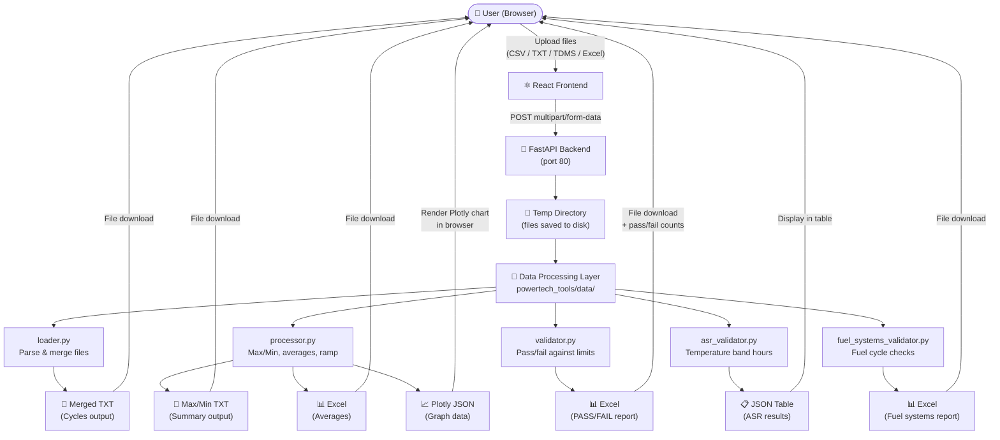

# Jerry — Data Flow

## Overview



---

## Per-Tool Flow

### Jerry Tool — TDMS → Cycles (Merge)
```
TDMS files  →  loader.py (merge_selected_files)  →  Merged TXT download
```

### Jerry Tool — Max/Min
```
Cycle TXT files (x100+)  →  processor.py (compute_maxmin_from_multiple_files)  →  Max/Min Summary TXT download
```

### Jerry Tool — Generate Averages
```
Cycle TXT files  →  processor.py (stream_file_means)  →  Excel with mean/min/max/stdev per column
```

### Jerry Tool — Cylinder Validation
```
Max/Min TXT  →  validator.py (validate_maxmin_file)  →  Excel with PASS/FAIL per cycle
                                                      →  Pass/fail counts shown in browser
```

### Jerry Tool — ASR Validation
```
Log files  →  asr_validator.py  →  Hours accumulated per temperature band
                                →  Pass/fail vs target hours
```

### Jerry Tool — Fuel Systems
```
Cycle TXT files  →  fuel_systems_validator.py  →  Excel with per-cycle check results
(Ptank, Tfuel, SOC)    (ramp rate, bounds,          (PASS/FAIL per check)
                         pre-conditioning)
```

### Jerry Tool — Cycle Viewer
```
Cycle TXT files  →  file_parser.py (load data)  →  Plotly JSON  →  Interactive chart in browser
```

### Report Graph Generator
```
Max/Min TXT  →  plot router  →  processor.py  →  Plotly JSON  →  Interactive graph in browser
                                                               →  Save as PNG to S Drive
Previously saved PNG  →  plot/load-png  →  Restore settings  →  Re-apply to new data
```

### SOC Calculator
```
Data file (CSV/TXT)  →  soc_converter.py  →  Add SOC column (from Ptank + Ttank lookup)
with Ptank & Ttank                         →  Download updated file
```

### Uncertainty Tool
```
Asset list Excel  →  AssetLookup (browser-side)  →  Search results displayed
(from S Drive)       no server call               
Manual inputs     →  uncertainty.ts calculations  →  Results table + chart (browser-side)
```

---

## File Formats

| Input | Used By |
|-------|---------|
| `.tdms` | Merge (TDMS → Cycles) |
| `.txt` / `.dat` / `.csv` | Max/Min, Averages, Validation, Fuel, Cycle Viewer |
| `.xlsx` / `.xls` | Uncertainty Asset List, SOC input |
| `.png` (saved by Jerry) | Graph Generator (restore settings) |

| Output | Produced By |
|--------|------------|
| `.txt` (tab-separated) | Merge, Max/Min |
| `.xlsx` | Averages, Validation, Fuel Systems |
| `.png` | Report Graph Generator |
| In-browser table | ASR Validation, Cycle Viewer |
| In-browser chart (Plotly) | Cycle Viewer, Graph Generator |
